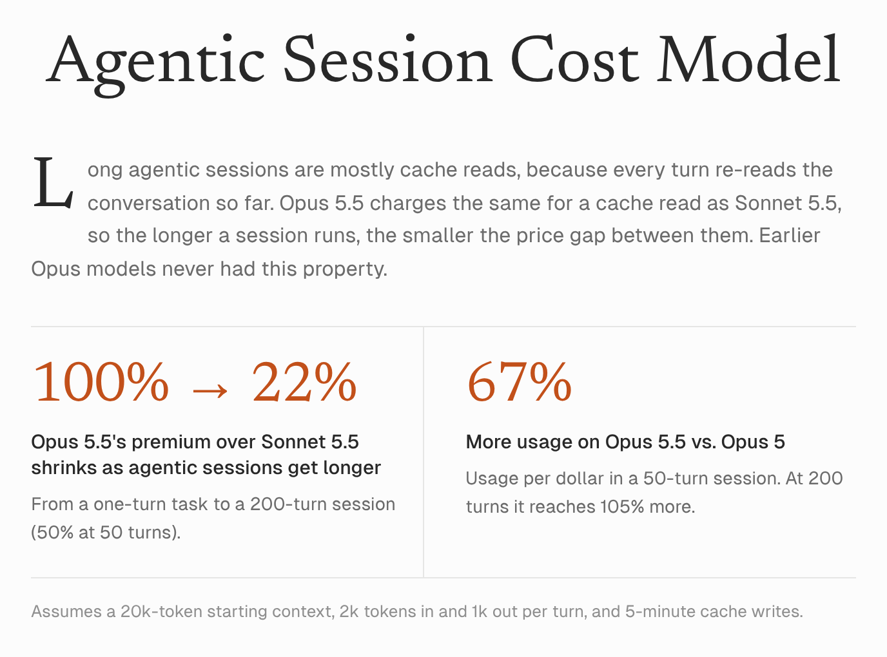
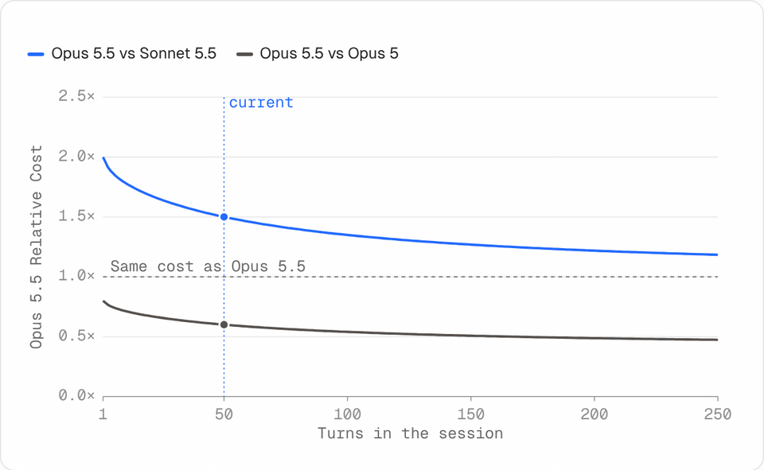
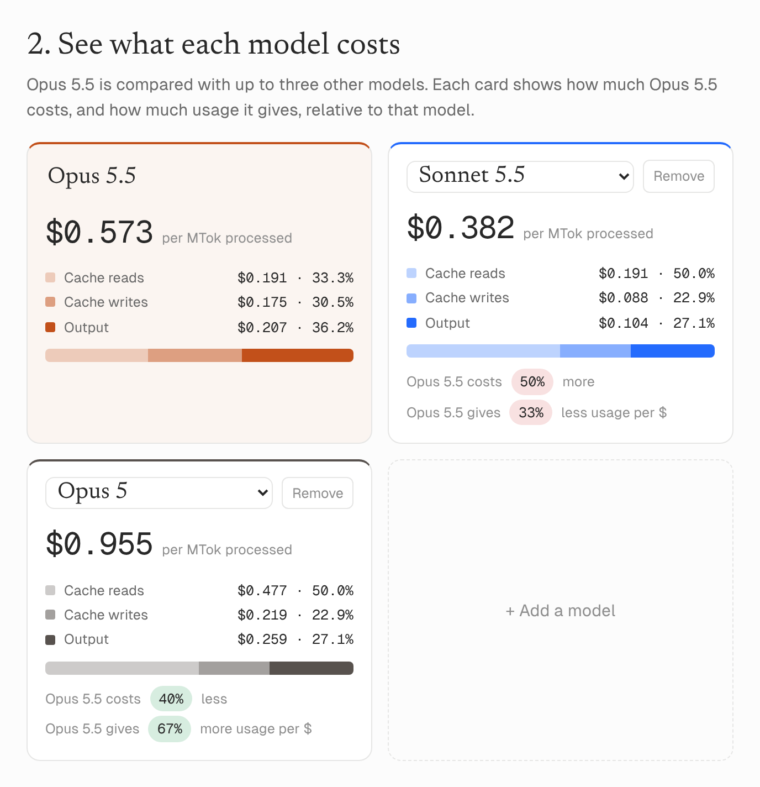

# model-pricing

Saves point-in-time snapshots of the [Claude pricing page](https://platform.claude.com/docs/en/about-claude/pricing) using the [Exa](https://exa.ai) API, so you can see how model prices change month to month.

The snapshot prices feed the [Agentic Session Cost Model](https://aaortiz.github.io/model-pricing/), an interactive page comparing what long agentic sessions cost on each Claude model.

<picture>
  <source media="(prefers-color-scheme: dark)" srcset="images/hero-dark.png">
  
</picture>

<picture>
  <source media="(prefers-color-scheme: dark)" srcset="images/chart-sweep-dark.gif">
  
</picture>

<picture>
  <source media="(prefers-color-scheme: dark)" srcset="images/cards-dark.png">
  
</picture>

## Requirements

- Python 3.9+
- An Exa API key ([dashboard.exa.ai](https://dashboard.exa.ai)). Each snapshot is a paid API call, about $0.002 at the time of writing.

## Setup

```bash
git clone https://github.com/aaortiz/model-pricing.git
cd model-pricing
python -m venv .venv
source .venv/bin/activate   # Windows: .venv\Scripts\activate
pip install -r requirements.txt
cp .env.example .env        # then put your key in .env
```

You can also set the key in your shell instead of using `.env`:

```bash
export EXA_API_KEY=your-key
```

## Usage

```bash
python pricing_exa_snapshot.py
```

This fetches the pricing page as it was on the 1st of each month from June to October 2026 and writes one file per month to `pricing-snapshots/`.

Snapshots that already exist are skipped, so re-running does not spend API credits. To re-fetch and overwrite them:

```bash
python pricing_exa_snapshot.py --force
```

## Output

Files are named `claude-model-pricing-YYYY-MM-DD.json`. Each one is the raw Exa response:

| Field | Contents |
| --- | --- |
| `results[].highlights` | Excerpts from the page, including the model pricing table in Markdown |
| `results[].summary` | Exa-generated summary of the page |
| `statuses` | Whether the fetch succeeded and where the content came from |
| `costDollars` | What the API call cost |

The snapshots in this repo are provided for reference. Pricing content belongs to Anthropic; check the live pricing page for current prices.

## Cost model page

`index.html` is an interactive Agentic Session Cost Model built on the snapshot prices. It compares what a long agentic session costs on Opus 5.5 against other Claude models, and includes the June to October 2026 price history.

View it live at <https://aaortiz.github.io/model-pricing/>.

It is a single self-contained file with no build step and needs no API key. To run it locally, open it in a browser:

```bash
open index.html             # macOS; on Windows or Linux, double-click the file
```

## License

[MIT](LICENSE)
